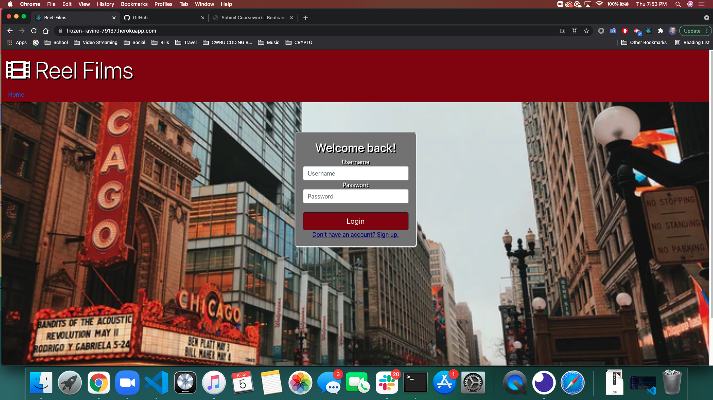

  # Reel Films
  
  ## License
  

  ## Description
  The user is able to find and save their favorite movies to a list, helping them create the perfect movie night!

  ## Table of Contents
  - [Description](#description)
  - [Installation](#installation)
  - [Usage](#usage)
  - [License](#license)
  - [Contributing](#contributing)
  - [Tests](#tests)
  - [Questions](#questions)

  ## Installation
  npm install 

  ## Usage
  The user must create an account. Once the user creates an account the will be redirected to the home screen where the are able to search for movies or access their saved movies list. When the search a movie they are given the option the dasave it to their list or to view more details. When the user accesses their list the have the option to remove a movie from their list or the view the movie for more details.

  ## License
  N/A
  
  ## Contributing
  Beau Fortier, Megan Knauss, Aaron Keller, and Griffin Pristic

  ## Tests
  There were no test involved

  ## Questions
  You can email any one of us
  
  GitHub: 
    [beau4ta](https://github.com/beau4ta)
    [mknauss97](https://github.com/mknauss97)
    [Bio-DigitalPulse](https://github.com/Bio-DigitalPulse)
    [gpristic](https://github.com/gpristic)
  
  Email us with any questions: 
    beaufortier13@gmail.com
    mknauss97@gmail.com
    aaron.k.keller@gmail.com

Link to the deployed app: https://frozen-ravine-79137.herokuapp.com/

